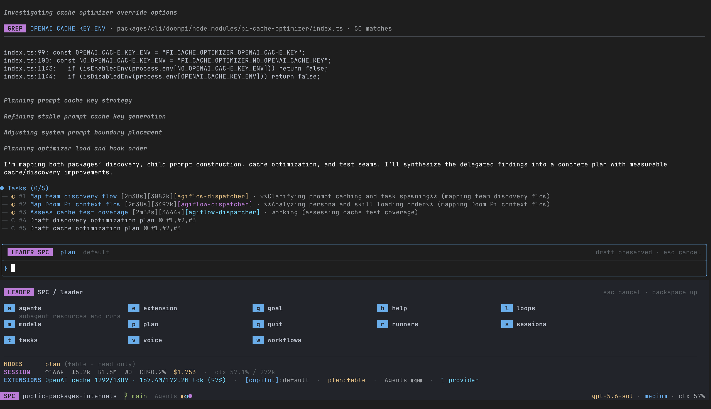

<p align="center">
  <picture>
    <source media="(prefers-color-scheme: dark)" srcset="packages/core/doompi/assets/logo.png">
    <source media="(prefers-color-scheme: light)" srcset="packages/core/doompi/assets/logo-light.png">
    
  </picture>
</p>

# DoomPi

**A coding agent that loads only the skills and tools you name.**

> It begins with one useful MCP server. Then another. Soon the agent fixing a heading
> wakes up with database tools, browser controls, and their small novel of schemas. This
> is our config.

DoomPi is an opinionated, composable distribution of
[Pi](https://github.com/earendil-works/pi). It is closer in spirit to Spacemacs, Doom Emacs, or a
curated Neovim setup than to a single plugin. It is tailored for people whose agents have too many
skills and tools. It turns extensions, skills, MCP servers, and system prompts into config instead
of background noise.



Plugin systems often rely on model-driven discovery to decide what context to load. Codex, for
example, selects plugins from their descriptions and then loads their skills, but relevant skills
do not always load reliably. DoomPi makes the session composition explicit. Pick a major mode and
some domains; add a profile if you want one. Four YAML files decide what loads; `doompi --explain`
tells you what got in, why, and what it costs before launch.

It borrows its shape from [Doom Emacs Core](https://github.com/doomemacs/core): quick to
start, close to Pi, opinionated where defaults help, and easy to pull apart when they do
not. Use it as-is, build your own config on top, or raid it for parts.

## Contents

| Guide                                                          | What it covers                                                               |
| -------------------------------------------------------------- | ---------------------------------------------------------------------------- |
| [Getting started](docs/getting-started.md)                     | Installation, requirements, DPI, sync storage, and permanent Pi registration |
| [Concepts](docs/concepts.md)                                   | Major modes, minor modes, domains, profiles, and context costs               |
| [Automation](docs/automation.md)                               | Autopilot, workflows, native plugin examples, and loops                      |
| [Features](docs/features.md)                                   | The complete DoomPi package and capability catalog                           |
| [Configuration](docs/configuration.md)                         | The four YAML files, merge rules, examples, and matrix checks                |
| [Trust and data boundaries](docs/trust-and-data-boundaries.md) | Executable inputs, credentials, model calls, voice, and telemetry            |
| [CLI reference](docs/cli-reference.md)                         | Commands, options, troubleshooting, and direct package use                   |
| [Architecture](docs/architecture.md)                           | Package composition, lifecycle ownership, and isolation                      |
| [Development](docs/development.md)                             | Workspace commands and maintainer release order                              |
| [Contributing](CONTRIBUTING.md)                                | Local setup, repository boundaries, checks, commits, and pull requests       |

## Install

```bash
npm install -g @agimon-ai/doompi
```

The package pins and installs the upstream Pi version used by `dpi`. The root package contains
the fixed host foundation only. Feature packages are selected by `.doom/modes.yaml` and installed
into the consumer repository when they are first needed.

See [Getting started](docs/getting-started.md) for the full setup and sync behavior.

## Status and requirements

DoomPi is alpha software. Configuration and package boundaries may still change between alpha
releases.

- Node.js 22.19.0 or newer for the published package
- Node.js 22.22.1 or newer when contributing from this workspace
- macOS or Linux on arm64 or x64 for the bundled Runner backend
- Pi 0.84.2 and Pi TUI 0.84.2 for packages that declare them as peer requirements

## Try DoomPi without replacing your Pi setup

`dpi` is the comparison runner. Use it to try DoomPi beside your current `pi` customization
before registering anything in Pi's settings:

```bash
dpi init
dpi sync
dpi
```

`dpi init` creates this repository's `.doom` configuration, `dpi sync` synchronizes the configured
package matrix, and `dpi` runs the isolated experiment. Your existing `pi` setup remains available
for comparison.

See [Getting started](docs/getting-started.md) for worktree storage, permanent registration, and
per-run matrix flags.

## Philosophy

An agent does not need every tool for every job. DoomPi separates the base session from
the things you switch on for a while: modes choose behavior, domains choose subject
matter, and profiles choose a point of view.

### Major and minor modes

A major mode is the base config. It names the extension layers that should run together. Minor
modes are batteries-included switches inside that base. They stack freely and keep their tools and
skills out of context until turned on.

### Domains

A domain is a named group of agent plugins. It carries the skills and MCP servers for one kind of
work, and `/domains` switches it while the session is running.

### Profile

A profile can supply a narrative, brand rules, or a different voice. It is optional; no profile is
a perfectly good profile.

See [Concepts](docs/concepts.md) for discovery, caching, merge behavior, and examples.

## What this buys you

Every tool schema and skill name competes for the same context. Loading less has two immediate
effects:

1. You spend fewer tokens before the work begins.
2. The model has fewer plausible-but-wrong tools and skills to choose from.

The savings get larger when each workflow job starts with its own config instead of inheriting the
last job's toolbox.

### Copilot

Press `SPC` on an empty draft to open a map of the commands available in the current composition.
When the keyboard is the wrong tool, autonomous Voice mode can keep the conversation going.

### Autopilot

Loop and Workflow keep work moving when you are not present. Together they can dispatch structured
jobs from one live session. See [Automation](docs/automation.md) for workflow syntax, tracked
examples, and loop behavior.

## Features

DoomPi is a distribution, not one giant extension. Each package owns one job; shared TUI, Cordis
services, and session contracts make them behave like one.

- **Foundation and interface:** configuration, domains, hashline tools, the Leader key, logs, and telemetry.
- **Coordinated work:** agent teams, persistent tasks, supervised commands, and staged compaction.
- **Context and access:** Help mode, scoped MCP access, structured questions, and operational metrics.
- **Modes and automation:** Plan, Loop, Goal, Workflow, and Voice modes.

See [Features](docs/features.md) for the complete package catalog and behavior of each feature.

## Configuration

DoomPi reads four configuration files:

- `config.yaml` defines runtime settings such as trust, editor, planning, and voice behavior.
- `modes.yaml` defines default packages, extension layers, and major modes.
- `domains.yaml` catalogs plugins and sets session access.
- `profiles.yaml` supplies persona files and environment defaults.

Personal defaults live in `~/.pi/.doom/`; repository overrides live in `<repository>/.doom/`.
See [Configuration](docs/configuration.md) for resolution rules, complete examples, and matrix
checks.

## Trust and data boundaries

DoomPi executes the extensions, remote Git/npm plugins, hooks, MCP stdio commands, workflows, and
shell commands you configure. Treat them as trusted executable code.

See [Trust and data boundaries](docs/trust-and-data-boundaries.md) for process privileges,
credentials, model calls, voice, and telemetry behavior.

## CLI reference

| Command                       | What it does                                                                   |
| ----------------------------- | ------------------------------------------------------------------------------ |
| `dpi init`, `dpi sync`, `dpi` | Creates, synchronizes, and runs the repository-scoped comparison setup         |
| `doompi init`, `doompi sync`  | Seeds personal config, builds synchronized state, and registers DoomPi with Pi |
| `doompi sync --check`         | Reports stale synchronized state or a required migration                       |
| `doompi --explain`            | Prints the resolved matrix and estimated prompt cost without launching Pi      |

See the [CLI reference](docs/cli-reference.md) for more commands, options, and direct-use guidance.

## Troubleshooting and direct use

See [Troubleshooting and direct use](docs/cli-reference.md#troubleshooting-and-direct-use) for sync
drift, Runner fallbacks, headless sessions, and direct package installation.

## Architecture

See [Architecture](docs/architecture.md) for standard Pi package composition, canonical
fingerprints, transition classification, synchronized bundles, shared-host Cordis lifecycle
ownership, and parent/child isolation.

## Development

See [Contributing](CONTRIBUTING.md) for local setup, repository boundaries, verification, commits,
and pull requests. See [Development](docs/development.md) for the maintainer release order.

DoomPi is maintained by [Agimon](https://agimon.ai/about).

## License

[MIT](LICENSE)
