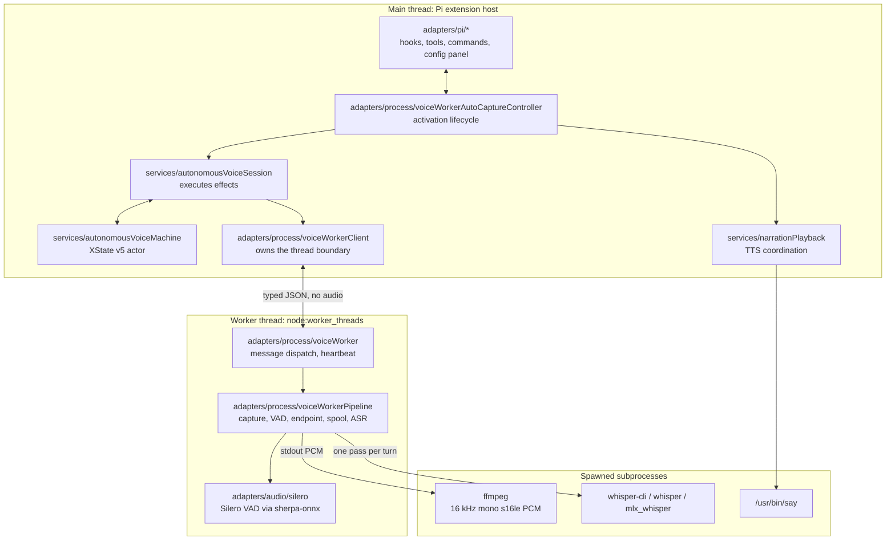
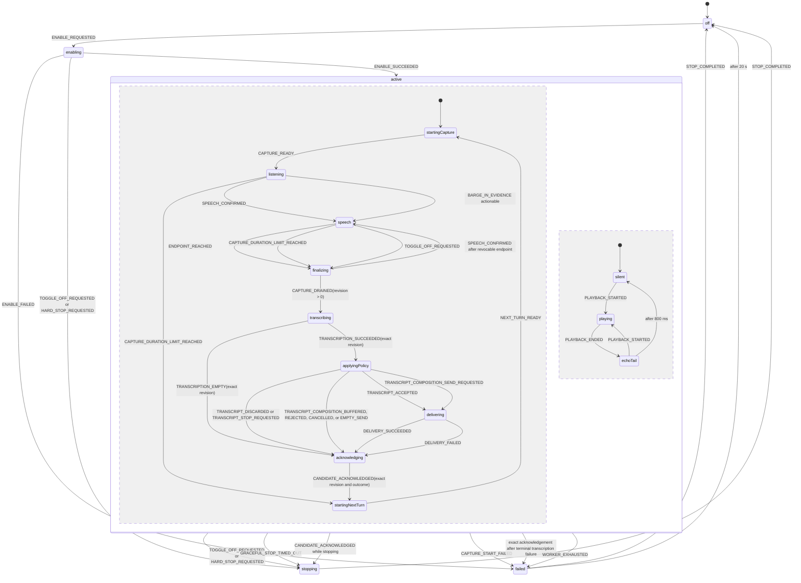
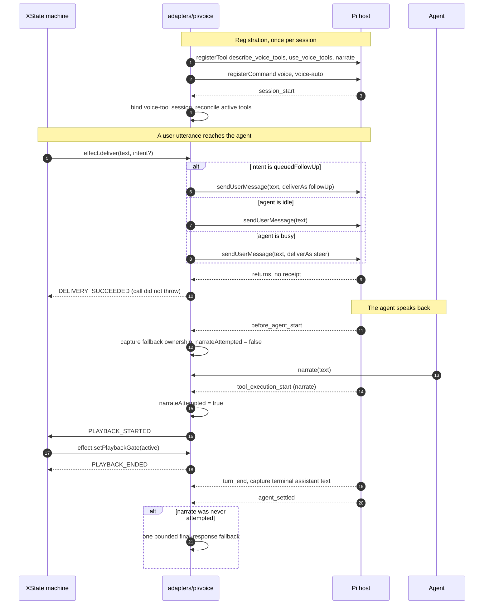
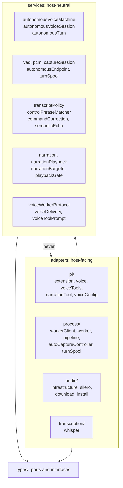
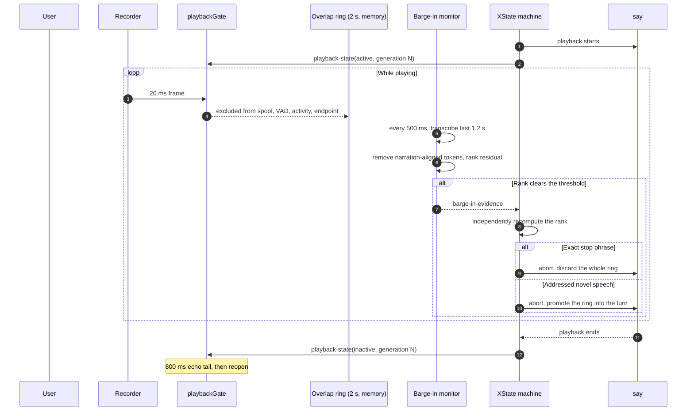

# Autonomous Voice Architecture

How `@agimon-ai/doompi-voice` is put together, and how its state machine relates to Pi.

This document is descriptive. [SPEC.md](./SPEC.md) is the normative contract and wins on any
question of what the system _must_ do; this one explains what the code _is_. Where the two
disagreed, the disagreements are listed in [Known divergences](#known-divergences) rather than
quietly reconciled.

## Contents

- [1. What runs where](#1-what-runs-where)
- [2. One autonomous turn](#2-one-autonomous-turn)
- [3. The lifecycle machine](#3-the-lifecycle-machine)
- [4. Voice and Pi](#4-voice-and-pi)
- [5. Modules and services](#5-modules-and-services)
- [6. Narration, gating, and barge-in](#6-narration-gating-and-barge-in)
- [Known divergences](#known-divergences)

---

## 1. What runs where

Voice spans three execution contexts. Almost every surprising behaviour in the package traces back
to something having to cross one of these boundaries.



The boundary is constructed in exactly two places: `voiceWorkerClient.ts`
(`new Worker(workerUrl, { name: 'doompi-voice' })`) and `voiceWorker.ts`
(`if (!isMainThread) startVoiceWorker()`). Every subprocess is spawned from one file,
`adapters/audio/infrastructure.ts`, which is the only module in `src/` that imports
`node:child_process`.

Two consequences worth holding onto:

- **`say` runs on the main thread while `ffmpeg` runs in the worker.** The two halves of the
  half-duplex problem are therefore in different threads, which is why playback gating is a
  protocol message (`playback-state`) rather than a local boolean.
- **No audio crosses the protocol.** `assertNoRawAudio` (`voiceWorkerProtocol.ts`) rejects any
  `ArrayBuffer`, typed array, or key named `audio` / `pcm` / `wav` / `buffer` / `rawAudio` on any
  message. PCM lives and dies in the worker and its private spool.

The manual `SPC v v` dictation path is a separate controller
(`adapters/process/voiceWorkerSessionController.ts`) that reuses the same worker but none of the
lifecycle machine below.

---

## 2. One autonomous turn

The path a spoken sentence takes from microphone to Pi prompt.

```mermaid
sequenceDiagram
  autonumber
  participant U as User
  participant FF as ffmpeg
  participant VAD as VAD + Silero
  participant EP as AutonomousEndpoint
  participant SP as turn spool
  participant ASR as Whisper
  participant M as XState machine
  participant Pi as Pi

  FF->>VAD: 20 ms PCM frame (640 bytes)
  VAD->>VAD: adaptive energy + Silero speechDetected
  VAD-->>M: capture-state: speech
  Note over M: listening to speech
  U-->>FF: stops talking
  VAD->>VAD: 600 ms trailing silence closes the segment
  VAD->>EP: speechEnded(utteranceIdleMs, evidence)
  EP->>EP: arm one timer for the remainder
  EP-->>M: endpoint-reached
  Note over M: speech to finalizing; endpoint remains revocable
  alt Fresh confirmed speech before drain commits
    VAD-->>M: speech-confirmed
    Note over M: finalizing back to speech
  else Drain wins the terminal-operation gate
    M->>SP: effect.finalizeCapture
    SP->>SP: freeze, drain, snapshot once
    SP-->>M: capture-processing (informational)
    SP-->>M: capture-drained (positive revision)
    Note over M: finalizing to transcribing
    SP->>ASR: one pass over the exact frozen WAV revision
    ASR-->>M: transcript-candidate (same revision)
    Note over M: transcribing to applyingPolicy
    M->>M: fail-closed admission and transcript policy
    Note over M: applyingPolicy to delivering or acknowledging
    M->>Pi: effect.deliver nonblank text (if accepted)
    Pi-->>M: returns (no receipt)
    M->>SP: acknowledge exact revision and outcome
    SP-->>M: candidate-acknowledged (exact revision and outcome)
    Note over M: acknowledging to startingNextTurn
  end
```

Two facts this diagram exists to make unmissable, because both routinely surprise people and both
drove recent design work:

- **A turn produces exactly one transcript.** `transcribe()` (`voiceWorkerPipeline.ts`) reads
  the exact frozen WAV revision in a single pass. `CAPTURE_PROCESSING` is only a progress event;
  `CAPTURE_DRAINED` is the sole revision authority. There is no interim or streaming ASR, so the
  transcript policy never sees a partial hypothesis. A command spoken after a brief pause arrives
  glued to the sentence before it unless the endpoint window is short enough to split the turn.
- **A soft endpoint can be revoked before drain commits.** A fresh confirmed 120 ms speech run moves
  the lifecycle from `finalizing` back to `speech`; the shared capture terminal-operation gate ensures
  that drain and abort cannot both mutate the recorder or spool.
- **The VAD's 600 ms trailing window is inside `utteranceIdleMs`, not additional to it.**
  `speechEnded` (`autonomousEndpoint.ts`) arms a timer for
  `utteranceIdleMs - observedSilence`, so the default 3000 ms means roughly 3 s of true silence in
  total, not 3.6 s.

**The composing branch.** While a composition draft is collecting, `effect.beginCapture` carries
`composing: true` (`autonomousVoiceMachine.ts`) and the session substitutes
`composeUtteranceIdleMs` (default 1200 ms) for `utteranceIdleMs`
(`autonomousVoiceSession.ts`). That is what lets a short command such as `that's it` finalize
as its own turn. Over-splitting is harmless in that mode and only that mode, because draft
segments are rejoined with a space.

---

## 3. The lifecycle machine

One XState v5 actor owns the autonomous session. The Pi adapter and the worker event handlers only
translate external input into machine events and execute machine-requested effects.

`active` is a **parallel** state: capture and playback advance independently, which is what allows
the microphone to stay live while the agent is speaking.



The two regions inside `active` are `capture` (upper) and `playback` (lower), separated by
mermaid's `--`. They run concurrently.

Edges are drawn from `active` where the real transition leaves the parallel region for a top-level
node, because mermaid cannot address a top-level state from inside a composite without creating a
duplicate. Their true origins are: `CAPTURE_START_FAILED` from `startingCapture`;
`TRANSCRIPTION_FAILED` and `TRANSCRIPTION_TIMED_OUT` first move from `transcribing` to `acknowledging`, mark the frozen revision discarded, and enter `failed` only after an exact acknowledgement. `CANDIDATE_ACKNOWLEDGED` from `acknowledging` instead enters `stopping` when `stopRequested` is already set. XState writes the terminal targets as `#autonomousVoice.failed` and `#autonomousVoice.stopping`.

A newer `PLAYBACK_STARTED` arriving during `playing` supersedes the current generation in place; it
is omitted from the diagram as a self-loop only to keep the region readable.

### The states

| Region   | State              | Entry action                                 | What it means                                    |
| -------- | ------------------ | -------------------------------------------- | ------------------------------------------------ |
| top      | `off`              | `cancelGracefulStopDeadline`, `clearSession` | Owns no recorder, worker, timer, or draft        |
| top      | `enabling`         | `requestEnable`                              | Worker starting; not yet listening               |
| top      | `active`           | none                                         | Parallel; capture and playback both live         |
| top      | `stopping`         | `requestStop`                                | Graceful or hard teardown in flight              |
| top      | `failed`           | `reportFailure`, `requestHardStop`           | Terminal; auto-exits to `off` after 20 s         |
| capture  | `startingCapture`  | `requestCapture`                             | Waiting on the first valid PCM frame             |
| capture  | `listening`        | none                                         | Live recorder, no confirmed speech               |
| capture  | `speech`           | none                                         | Confirmed speech; endpoint timer armed           |
| capture  | `finalizing`       | none                                         | Soft endpoint is revocable until drain wins      |
| capture  | `transcribing`     | none                                         | One ASR pass over the positive frozen revision   |
| capture  | `applyingPolicy`   | none                                         | Fail-closed admission, then policy               |
| capture  | `delivering`       | none                                         | Nonblank text handed to Pi once                  |
| capture  | `acknowledging`    | `requestAcknowledgement`                     | Exact revision and outcome awaiting confirmation |
| capture  | `startingNextTurn` | `requestNextTurn`                            | Minting the next capture and turn identity       |
| playback | `silent`           | none                                         | Microphone fully eligible                        |
| playback | `playing`          | none                                         | TTS active; frames excluded from the turn        |
| playback | `echoTail`         | none                                         | 800 ms grace after playback ends                 |

**Graceful and hard stop differ at admission.** Toggle-off aborts a pending admission or correction request but may let the already-confirmed turn continue with its deterministic unchanged-policy fallback. It prevents every next-turn effect. Hard stop, extension disposal, and session shutdown abort admission without delivering a new turn. Both paths share one session cleanup promise, and `STOP_COMPLETED` is emitted only after cleanup settles or the bounded forced-cleanup policy reports its outcome.

### The guards

| Guard                          | Semantics                                                                 |
| ------------------------------ | ------------------------------------------------------------------------- |
| `isCurrentSession`             | Event's `sessionId` matches context                                       |
| `isCurrentCapture`             | Session, capture, and turn all match                                      |
| `isCurrentDrainedRevision`     | Current identity and a positive safe-integer drained revision             |
| `isCurrentRevision`            | Identity and revision exactly match the frozen context revision           |
| `isCurrentAcknowledgement`     | Identity, revision, and committed/discarded outcome exactly match context |
| `isCurrentPlayback`            | Playback generation equals context                                        |
| `isNewPlayback`                | Playback generation is strictly greater than context                      |
| `isExactCurrentBargeInCommand` | Current generation, and the probe was an exact stop phrase                |
| `isActionableCurrentBargeIn`   | Current generation, not a stop phrase, and the evidence rank clears 80    |
| `stopWasNotRequested`          | `!context.stopRequested`                                                  |
| `stopWasRequested`             | Declared but never referenced; see divergences                            |

Identity and revision guards are why a slow ASR result, a restarted worker, or a stale playback callback cannot mutate a turn that has already moved on. Outcome matching also prevents a duplicate or conflicting acknowledgement from deleting a spool under the wrong decision.

### What the UI shows

`autonomousVoiceState()` (`autonomousVoiceMachine.ts`) collapses the tree into
`off | starting | listening | speech | processing | stopping | failed`. Everything from
`finalizing` onward, six distinct states, projects to the single value `processing`. The modeline
is therefore deliberately coarser than the machine, and a user watching the indicator cannot tell
transcription from delivery.

---

## 4. Voice and Pi

Pi is the host. Voice never drives the agent loop directly; it subscribes to lifecycle events and
submits user messages, and the agent calls back in through registered tools.



### Pi into Voice

| Hook                   | Site           | What it does                                                                   |
| ---------------------- | -------------- | ------------------------------------------------------------------------------ |
| `session_start`        | `extension.ts` | Refreshes config readiness, gates `waitUntilConfigured`                        |
| `session_start`        | `voice.ts`     | Deactivates capture, rebinds the voice-tool session, consumes a reload handoff |
| `before_agent_start`   | `voice.ts`     | Refreshes `activeContext`, reconciles the tool set                             |
| `before_agent_start`   | `voice.ts`     | Captures fallback-narration ownership for the run                              |
| `tool_execution_start` | `voice.ts`     | Notes that `narrate` was attempted, which suppresses the fallback              |
| `turn_end`             | `voice.ts`     | Stores the terminal assistant text                                             |
| `agent_settled`        | `voice.ts`     | Fires the zero-call fallback if `narrate` was never attempted                  |
| `session_shutdown`     | `extension.ts` | Disposes the cordis fiber and the host connection                              |

### Voice into Pi

The delivery branch is the whole contract (`voice.ts`):

```ts
if (intent === 'queuedFollowUp') {
  pi.sendUserMessage(text, { deliverAs: 'followUp' });
  return;
}
if (context.isIdle()) {
  pi.sendUserMessage(text);
  return;
}
pi.sendUserMessage(text, { deliverAs: 'steer' });
```

**Delivery success is weaker than it looks.** `sendUserMessage` exposes no downstream receipt, so
`DELIVERY_SUCCEEDED` means only that the call did not throw (`voiceDelivery.ts`). Voice must
not claim confirmed host delivery, retry automatically, or clear a composed draft on the strength
of it.

Three tools are registered, and all three are removed from the active set unless autonomous voice
is exactly `active` with a matching TUI session (`voice.ts`):

| Tool                   | Purpose                                                         |
| ---------------------- | --------------------------------------------------------------- |
| `describe_voice_tools` | Lists contributed capabilities and mints the catalog token      |
| `use_voice_tools`      | Runs a validated sequential batch against that catalog          |
| `narrate`              | Speaks one primary-agent utterance and awaits physical playback |

Contributed capabilities such as `minor_mode`, `major_mode`, `activate_plan`, `exit_plan`,
`list_domains` and `switch_domains` are **not** Pi tools. They are catalog entries reachable only
through `use_voice_tools`, which is why the describe tool's description carries a digest of their
names.

---

## 5. Modules and services

The package enforces a strict inward dependency rule: `services/` is host-neutral and may import
only other services, types, and schemas. Anything touching Pi, the filesystem, a subprocess, or
`node:*` lives in `adapters/`. This is checked by vibe-lint's `service-boundary` rule, and it is
what makes the machine testable without Pi, ffmpeg, or Whisper.



### Cordis services

| Direction | Service                           | Site                                              |
| --------- | --------------------------------- | ------------------------------------------------- |
| provides  | `DOOM_VOICE_TOOLS_SERVICE`        | `voice.ts`                                        |
| provides  | `DOOM_NARRATION_SERVICE`          | `voice.ts`                                        |
| injects   | `DOOM_HELP_SERVICE`               | `extension.ts`                                    |
| injects   | `DOOM_UI_HUB_SERVICE`             | `extension.ts`                                    |
| injects   | `DOOM_MINOR_MODE_CATALOG_SERVICE` | `voice.ts`                                        |
| listens   | `DOOM_ASK_USER_BLOCKED_EVENT`     | `voice.ts`, blocks delivery while a modal is open |

### Worker protocol

Protocol version 1. Every message carries `{ version, sequence }`, and `assertExactKeys` rejects
unknown fields on both sides.

**Commands, main thread to worker:**

| Command                 | Payload                                                                                   |
| ----------------------- | ----------------------------------------------------------------------------------------- |
| `initialize`            | `spoolDirectory`, `activityHz`                                                            |
| `begin-capture`         | identity, `mode`, `config`, `maxDurationMs`, `utteranceIdleMs`, `transcriptionTimeoutMs?` |
| `finalize-capture`      | identity, `reason`                                                                        |
| `cancel-capture`        | identity                                                                                  |
| `acknowledge-candidate` | identity, `revision`, `outcome`                                                           |
| `playback-state`        | `playbackGeneration`, `active`, `referenceText?`, `startPhrases?`, `stopPhrases?`         |
| `confirm-barge-in`      | identity, `playbackGeneration`, `outcome`                                                 |
| `shutdown`              | `reason`                                                                                  |

**Events, worker to main thread:**

| Event                    | Consumed by the autonomous session?              |
| ------------------------ | ------------------------------------------------ |
| `capture-state`          | Partly: `listening`, `speech`, `processing` only |
| `endpoint-reached`       | Yes                                              |
| `transcript-candidate`   | Yes, when `final`                                |
| `candidate-acknowledged` | Yes                                              |
| `barge-in-evidence`      | Yes                                              |
| `drained`                | Yes                                              |
| `failure`                | Yes, routed by code                              |
| `ready`                  | No, handled by the client                        |
| `heartbeat`              | No, handled by the supervisor                    |
| `activity`               | **No, dropped**                                  |
| `recovered`              | **No, dropped**                                  |

Capability strings gate optional fields, so an older worker degrades rather than failing:
`capture`, `transcription`, `durable-spool`, `adaptive-vad`, `silero-vad`, `transcription-timeout`,
`ranked-barge-in`, `intentional-barge-in`. `silero-vad` is advertised only when the model and
native runtime actually initialize; capture continues on adaptive VAD alone when they do not.

#### Restart ownership and shutdown

Protocol v1 is unchanged. Reliability comes from parent and spool phase tracking, not new messages. `voiceWorkerClient.ts` retains `capturing`, `finalization-requested`, `frozen`, `candidate-observed`, or `acknowledgement-pending` for the active identity. Reconnect replays only work still owned by that phase: it resumes capture/finalization, lets a frozen spool reuse its WAV for ASR, sends nothing after the candidate was observed, or replays the exact pending acknowledgement.

The spool manifest and acknowledgement tombstone preserve the matching durable phase. An identical acknowledgement is idempotent. A stale revision or conflicting outcome fails without deleting the spool. Clean parent progress or ordered shutdown removes the tombstone; uncertain termination keeps recoverable ownership.

Pipeline operations and shutdown share one ordered barrier. Shutdown marks the pipeline closed, aborts active ASR and capture, suppresses late publications, then lets worker disposal close the message port. The parent waits up to two seconds for that graceful worker exit before forcing termination. Repeated shutdown and disposal calls await the same promises.

---

## 6. Narration, gating, and barge-in

The hardest part of the package, and the easiest to misread. The default is **half-duplex**: the
recorder never stops, but while TTS plays, its frames are excluded from the user's turn.



Evidence is ranked deterministically (`narrationBargeIn.ts`):

| Guard                                              | Weight |
| -------------------------------------------------- | ------ |
| Exact command-only stop phrase after echo removal  | 100    |
| At least two novel residual tokens                 | 45     |
| Configured intentional-address phrase detected     | 40     |
| Novel residual is at least 30% of the probe        | 20     |
| At least four novel residual tokens                | 15     |
| At least 400 ms voiced                             | 15     |
| Peak at least 6 dB above the session noise profile | 10     |
| Signal variation at least 3 dB                     | 10     |
| Whole probe remains strongly narration-aligned     | -40    |

Free-form interruption requires a configured address phrase, at least two novel residual tokens,
and a total of at least 80. An exact stop phrase scores 100 but resolves as `discard`, never
`promote`, so the command and any trailing narration words cannot become a prompt.

**The default that catches people out:** `startPhrases` resolves to an empty list
(`configPolicy.ts`), and free-form interruption requires an address. Out of the box, therefore,
only an exact configured stop phrase can interrupt narration, and if `stopPhrases` is also empty
nothing can. Raw VAD energy alone may never abort TTS.

Note also that no acoustic echo cancellation exists. Echo is rejected _semantically_, by diffing
the probe transcript against the exact narration reference.

---

## Known divergences

Places where the code and [SPEC.md](./SPEC.md) do not agree, or where the code contradicts itself.
Recorded rather than fixed, because each is a design decision rather than a typo.

| Divergence                                      | Detail                                                                                                                                                                                                                                                    |
| ----------------------------------------------- | --------------------------------------------------------------------------------------------------------------------------------------------------------------------------------------------------------------------------------------------------------- |
| `ACTIVITY_OBSERVED` and `SPEECH_ENDED` are dead | Declared in the event union, never sent, never handled. The worker publishes `activity` at 8 Hz carrying `levelDbfs` and `speechProbability`, and the session has no branch for it, so AV-USER-006's responsiveness clause is unobservable from the host. |
| `recovered` events are dropped                  | The worker publishes them (`voiceWorkerPipeline.ts`), nothing consumes them, so AV-WORKER-002's requirement to surface recovered spools has no mechanism.                                                                                                 |
| `narrationFailed` has no implementation         | SPEC lists it as a playback state. TTS failure is handled outside XState, in `narrationPlayback.ts`, by flipping a private flag. The playback region has exactly three nodes.                                                                             |
| UI indicator list is wrong in SPEC §4.12        | It names `composing`, `sending`, `starting`, `stopping` and `error`, none of which exist in `AutoCaptureIndicatorState`, and omits `confirming` and `waiting`, which do. Composition appears only in the status string.                                   |
| `confirming` is unreachable                     | `confirmationPending` is hard-coded `false` at its only call site (`autonomousVoiceSession.ts`).                                                                                                                                                          |
| Guard `stopWasRequested` is unused              | Declared at `autonomousVoiceMachine.ts`; the equivalent check is written inline in `acknowledging` instead.                                                                                                                                               |
| No `invoke:` anywhere                           | SPEC §3.5 permits "invoked actors or explicit effects". The machine uses only emitted effects, so the follow-on requirement that exiting a state cancels its invoked actor has no machine-level implementation; cancellation is manual in the session.    |
| Duration limit arrives as a failure             | A recoverable lifecycle boundary is transported as `failure` with code `capture_duration_limit`.                                                                                                                                                          |
