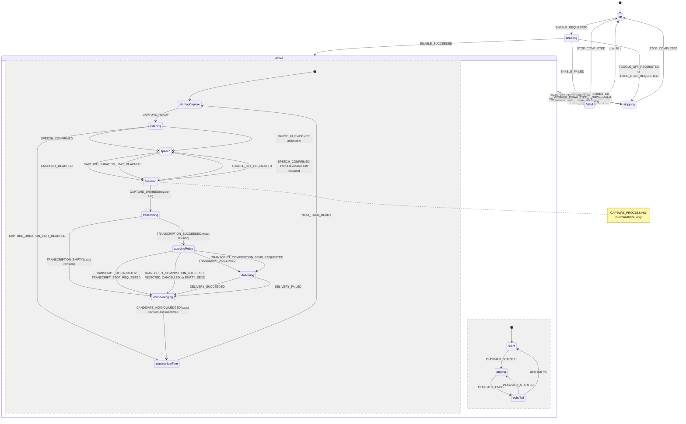

# Autonomous Voice Specification

## 1. Purpose and status

This is the normative product and engineering specification for autonomous voice in `@agimon-ai/doompi-voice`.

`SPC v e` enables a hands-free loop that listens for a user utterance, detects its end, transcribes it locally, submits it to Pi, lets the primary agent speak its own updates, and returns to listening. The loop must continue without requiring another key press. Pressing `SPC v e` again stops that loop predictably. Direct primary-agent narration is authoritative. Voice MUST NOT infer automatic intent, plan, milestone, or tool-progress speech from Pi lifecycle events. Its only lifecycle-derived speech is the bounded final-response fallback in AV-USER-008 when the agent never attempts `narrate`.

This document describes the required end state. Existing code and passing unit tests are not evidence of compliance unless they satisfy the acceptance criteria in this specification through the canonical runtime.

The lifecycle MUST be implemented with **XState v5**. Hand-written state flags may exist inside leaf modules, but they MUST NOT independently own autonomous lifecycle transitions.

The manual `SPC v v` dictation flow remains a separate product mode and is not governed by this specification except for shared recorder, transcription, and privacy requirements.

`MUST`, `MUST NOT`, `SHOULD`, and `MAY` are normative.

[ARCHITECTURE.md](./ARCHITECTURE.md) is the companion descriptive document. It explains how the implementation is actually arranged and records the places where it currently diverges from this specification.

## 1.1 Cross-extension capability façade

When autonomous voice is exactly `active`, the Pi tool set MUST contain the
two stable façade names `describe_voice_tools` and `use_voice_tools` plus the
standalone mode-owned `narrate`, while preserving unrelated active tools.
Contributing extensions register callbacks through
`@agimon-ai/doompi-extension-contracts/voice-tools`; those callbacks MUST NOT
become direct Pi tools. `narrate` MUST NOT enter the façade capability catalog.

The catalog token is session-scoped and opaque. A batch MUST use a fresh token,
preflight every call before side effects, execute sequentially, and validate
callback results. Because the host sends only tool result content to the model
and keeps result details for logs and the TUI, `describe_voice_tools` MUST place
the token and the capability catalog in model-visible content, and
`use_voice_tools` MUST place a fresh token and every call result there too.
Publishing either solely in result details does not satisfy this requirement. All three Voice-owned tools MUST be reconciled together.

Contributed capability names are otherwise absent from pushed context, so an agent
asked to use one has nothing to match on and never calls the façade. The
`describe_voice_tools` description MUST therefore carry a digest of the registered
capabilities as capability name and description only. That digest MUST NOT contain a
catalog token, a capability input schema, or per-activation enablement, so the token
remains obtainable only from a live result and activation does not rewrite the tool
description. Voice MUST republish the description when the digest changes and MUST NOT
republish it otherwise.
Starting, draining, deactivation, stale or mismatched sessions, headless hosts,
and shutdown MUST remove them from the active set or fail execution closed
without restoring stale tools.

Only a successfully committed voice-originated domain reload MAY resume
autonomous capture. The resumed activation MUST use fresh session, capture, and
turn identities and MUST NOT attach an unrelated previous spool.

## 2. User contract

### AV-USER-001: Enable

When autonomous voice is off, pressing `SPC v e` MUST:

1. validate configuration and local dependencies;
2. start the supervised voice worker;
3. start one microphone capture;
4. show `starting` until the worker confirms that valid PCM frames are arriving;
5. show `listening` only after that confirmation.

If any step fails, the mode MUST return to `off`, stop acquired resources, and show an actionable error.

### AV-USER-002: Automatic turn processing

While enabled, a normal user turn MUST complete without another key press:

```text
listening
  -> speech
  -> endpoint reached
  -> freeze capture
  -> transcribe once
  -> submit once
  -> start next capture
  -> listening
```

`SPC v e` MUST NOT be required to trigger endpointing, transcription, submission, acknowledgement, or the next capture.

### AV-USER-003: Toggle off

Pressing `SPC v e` while autonomous voice is enabled MUST request a graceful stop and MUST be idempotent.

- If no confirmed user speech is pending, the active capture MUST be cancelled and the mode MUST reach `off` promptly.
- If confirmed speech is already being finalized or transcribed, that one turn MAY finish, but no new capture may start.
- A stop request MUST NOT start a second transcription.
- A stop request MUST abort any outstanding transcript admission, command-correction, or fallback-narration model request. A confirmed capture turn that is allowed to finish MUST fall back to its deterministic unchanged-policy result.
- A stop request MUST NOT leave the UI in `listening`, `processing`, `transcribing`, or `stopping` indefinitely.
- The graceful-stop deadline is 20 seconds. At the deadline, outstanding capture, ASR, admission, model, and playback work MUST be aborted, shared cleanup MUST settle or report its bounded forced-cleanup outcome, and the mode MUST enter `off` with an error notification.

Extension disposal and session shutdown are hard stops: they MUST abort outstanding work rather than deliver a new user turn.

### AV-USER-004: Continuous operation

After any committed, empty, or deliberately discarded turn, the machine MUST either start exactly one next capture or enter a visible terminal state. It MUST never report `listening` without a live worker capture.

### AV-USER-005: Exact delivery

The submitted prompt MUST be the deterministic transcript-policy result, with only documented control-phrase removal and an optional validated ASR-wording correction. A correction MUST consist solely of bounded, non-overlapping exact-source replacements whose replacement text is an exact phrase in the bounded runtime reference context. It MUST preserve intent, content, constraints, ordering, specificity, negation, and every number.

A language model MUST NOT return or submit a free-form rewritten prompt. Runtime context is untrusted quoted reference vocabulary, never an instruction or a source of additional user content. Missing or ambiguous context, invalid output, timeout, cancellation, or model failure MUST deliver the unchanged transcript-policy result.

### AV-USER-006: Responsiveness

With a healthy recorder and local model:

- microphone activity SHOULD update at least 8 times per second;
- endpointing MUST occur `utteranceIdleMs` after the last accepted voiced frame;
- ASR MUST have a configurable `transcriptionTimeoutMs` deadline from 1,000 to 120,000 ms, defaulting to 15,000 ms;
- after the endpoint delay, target-machine endpoint-to-delivery p95 SHOULD be below 2.5 seconds once the local ASR model is warm.

Latency measurements MUST separate endpoint waiting, recorder drain, WAV creation, ASR, transcript policy, delivery, and next-capture startup.

### AV-USER-007 - Explicit composition

While autonomous voice is active, a normalized leading phrase from the configured `composeOpenPhrases` set MUST open a session-scoped composition draft. The remainder of that segment and later finalized content segments MUST be buffered without prompt delivery. A phrase from `composeSendPhrases` MUST submit the combined draft once, and a phrase from `composeCancelPhrases` MUST discard it without submitting.

Composition exists for long spoken prompts, so that a multi-part prompt is not submitted half-written. An ordinary short utterance needs no phrase and is delivered when it finalizes.

The three sets default to `[hey doom, doom prompt]`, `[that's it, doom send]` and `[doom cancel, scratch that]`. Matching MUST tolerate bounded per-token transcription variance rather than requiring exact equality, because a transcriber routinely returns a near miss for a phrase the user said correctly. A send or cancel phrase MUST be recognised when it is the entire finalized segment, and MAY additionally be recognised as a trailing phrase closing a longer segment only when sentence punctuation precedes it, at a stricter tolerance, with the preceding content preserved into the draft. A phrase appearing anywhere else in a segment MUST remain content.

Composition control phrases MUST be decided before optional command correction. Send and cancel phrases MUST remain ordinary transcript content outside composition. A busy composed submission MUST use Pi follow-up delivery rather than steering the current turn. Empty send and draft-limit rejection MUST retain composition and produce visible feedback. Synchronous delivery failure MUST retain the draft for a later retry.

Draft text MUST remain outside XState context, be limited to 32,768 Unicode characters, and be cleared on cancellation, successful synchronous submission, deactivation, reload, shutdown, or session cleanup. Worker restart and idle capture rotation within the same autonomous session MUST preserve it. The UI MUST distinguish collecting and submitting from ordinary listening.

### AV-USER-008 - Direct primary-agent narration

Each `narrate` call MUST contain one complete utterance of at most 4,096 characters after the shared narration boundary. Voice MUST speak the normalized primary-agent wording verbatim, without chunking, rewriting, or another model pass. The call MUST await physical TTS settlement and return exactly one of `completed`, `interrupted`, `superseded`, or `failed`.

When `narrate` is available, primary-agent guidance MUST require a call when starting work, after an interesting or meaningful finding, before requesting user feedback or a decision, and before ending the task with a user-facing final response. Final narration MUST speak the complete answer, including every user-relevant conclusion, question, warning, result, and next action that appears in the written response. It MUST NOT provide a shorter summary while leaving essential information only in text. A short conversational, clarification, refusal, or error turn needs one call that speaks the complete answer. The agent MUST keep the answer within the 4,096-character narration limit while autonomous Voice is active. Ordinary response text and repetitive low-level status or progress prose MUST NOT automatically enter playback.

For a run that begins in an exact-active matching TUI Voice session, the adapter MUST track whether `tool_execution_start` was observed for `narrate`. If the run reaches a terminal assistant response and settles without such an attempt, Voice MUST produce exactly one final-response fallback. Any attempted `narrate` call MUST suppress the fallback regardless of validation, execution, or playback outcome; Voice MUST NOT duplicate or retry attempted direct speech. Ownership MUST include the session-manager identity, session ID, and activation generation captured at `before_agent_start`. Inactive, replaced, deactivated, or reactivated ownership MUST fail closed at settlement.

Fallback input MUST undergo control-character, Markdown, code, URL, email, credential, secret, and absolute-path sanitization. The sanitized final MUST be bounded to 4,096 Unicode characters. At most 320 characters MUST be spoken deterministically without a model call. Longer finals MAY reuse `voice.autoCapture.model` to produce one strict JSON `speech` string with an eight-second deadline, a 192-token maximum, no reasoning, no retries, and no cache retention. Model output MUST be sanitized again and bounded to 640 characters. Missing, malformed, failed, or timed-out model output MUST degrade to a bounded deterministic excerpt that points to the written response instead of producing silence. This fallback MUST NOT generate intent, plan, milestone, or tool-progress speech.

Direct and fallback narration use `final` playback priority and await the same physical playback settlement. Session-scoped narration requests from task, workflow, user-feedback, and other extensions remain supported at higher `clarification` priority. Cancellation, confirmed barge-in, mode stop, reload, shutdown, stale-session replacement, or activation-generation replacement MUST settle or cancel affected work rather than strand it. `SPC v v` remains one-shot manual dictation and MUST NOT enable `narrate`, either façade, the fallback, or the Voice minor mode.

## 3. Canonical XState lifecycle

### 3.1 Authority

One XState actor owns the autonomous session. The Pi adapter and worker event handlers only translate external input into machine events and execute machine-requested effects.

No controller field such as `activationState`, `emptyRevision`, `candidateGeneration`, or `holdTimer` may create an independent lifecycle. Such values belong in machine state/context or in a leaf actor whose completion is represented by an XState event.

### 3.2 Top-level states



Required top-level state values:

- `off`
- `enabling`
- `active`
- `stopping`
- `failed`

`active` MUST be a parallel state with two concurrent regions. The `capture` region MUST contain:

- `startingCapture`
- `listening`
- `speech`
- `finalizing`
- `transcribing`
- `applyingPolicy`
- `delivering`
- `acknowledging`
- `startingNextTurn`

Narration/playback is the second region, not a replacement for the capture lifecycle:

- `silent`
- `playing`
- `echoTail`

Transitions drawn from `active` leave the parallel region for a top-level node. Their origins are
`CAPTURE_START_FAILED` from `startingCapture`, `TRANSCRIPTION_FAILED` and
`TRANSCRIPTION_TIMED_OUT` from `transcribing`, and `CANDIDATE_ACKNOWLEDGED` from `acknowledging`
when a stop has already been requested.

### 3.3 Machine context

The machine context MUST contain only bounded control data:

- activation/session identity;
- current capture and turn identity;
- current frozen revision, assigned only by `CAPTURE_DRAINED`;
- finalization reason and whether confirmed speech exists;
- whether stop was requested;
- current playback generation and phase;
- pending transcript/delivery outcome metadata;
- bounded composition control state, never composition text;
- bounded failure information;
- timestamps required for latency telemetry.

PCM, WAV buffers, unbounded transcripts, child-process handles, and private spool paths MUST NOT be stored in XState context.

### 3.4 Typed events

The machine MUST define and exhaustively handle typed events equivalent to:

- `ENABLE_REQUESTED`
- `ENABLE_SUCCEEDED`
- `ENABLE_FAILED`
- `CAPTURE_READY`
- `CAPTURE_START_FAILED`
- `CAPTURE_PROCESSING`
- `CAPTURE_DRAINED`
- `CAPTURE_DURATION_LIMIT_REACHED`
- `SPEECH_CONFIRMED`
- `ENDPOINT_REACHED`
- `TRANSCRIPTION_SUCCEEDED`
- `TRANSCRIPTION_EMPTY`
- `TRANSCRIPTION_FAILED`
- `TRANSCRIPTION_TIMED_OUT`
- `TRANSCRIPT_ACCEPTED`
- `TRANSCRIPT_DISCARDED`
- `TRANSCRIPT_STOP_REQUESTED`
- `TRANSCRIPT_COMPOSITION_BUFFERED`
- `TRANSCRIPT_COMPOSITION_REJECTED`
- `TRANSCRIPT_COMPOSITION_CANCELLED`
- `TRANSCRIPT_COMPOSITION_EMPTY_SEND`
- `TRANSCRIPT_COMPOSITION_SEND_REQUESTED`
- `DELIVERY_SUCCEEDED`
- `DELIVERY_FAILED`
- `CANDIDATE_ACKNOWLEDGED`
- `NEXT_TURN_READY`
- `PLAYBACK_STARTED`
- `PLAYBACK_ENDED`
- `BARGE_IN_EVIDENCE`
- `TOGGLE_OFF_REQUESTED`
- `HARD_STOP_REQUESTED`
- `GRACEFUL_STOP_TIMED_OUT`
- `STOP_COMPLETED`
- `WORKER_EXHAUSTED`

Capture is requested by the `startingCapture` entry effect rather than by an event, and echo-tail
expiry is a delayed transition rather than a typed event, so neither has a member here.

`ACTIVITY_OBSERVED` and `SPEECH_ENDED` are additionally declared in the implementation but
currently have no producer and no handler. They do not satisfy the exhaustive-handling requirement
above and MUST be either wired or removed.

Worker events MUST be rejected unless session, capture, turn, frozen revision, acknowledgement outcome, and playback generation match the current machine context where applicable. `CAPTURE_PROCESSING` is informational and MUST NOT establish a revision or enter transcription.

### 3.5 Invoked actors and effects

Long-running work MUST be represented as invoked XState actors or explicit effects whose result returns as a typed event:

- configuration/dependency preflight;
- worker startup/shutdown;
- capture begin/drain/cancel;
- ASR;
- transcript policy;
- user prompt delivery;
- candidate acknowledgement;
- TTS playback.

Exiting a state MUST cancel its cancellable invoked actor. Stale completions from cancelled actors MUST have no effect.

### 3.6 Lifecycle invariants

At all times:

1. At most one capture identity is current.
2. `listening` or `speech` implies one live recorder producing current-generation PCM.
3. A soft endpoint is revocable until drain commits. A fresh confirmed 120 ms speech run returns `finalizing` to `speech`; duration-limit and toggle-off finalization are not revocable.
4. `transcribing` implies `CAPTURE_DRAINED` established one positive frozen revision that cannot accept more PCM.
5. Processing, policy, delivery, and acknowledgement require that exact frozen revision.
6. A turn has at most one final ASR invocation and one delivery.
7. A final revision is acknowledged as exactly one committed or discarded outcome. An identical duplicate is idempotent; a stale revision or conflicting outcome cannot remove the spool.
8. `startingNextTurn` cannot run after a stop request.
9. `off` owns no recorder, ASR process, worker, TTS playback, timer, pending delivery, admission request, or composition draft, except after an explicitly reported bounded forced-cleanup deadline.
10. Every state has defined behavior for toggle-off, hard stop, worker exhaustion, and stale events.
11. Buffered composition segments are acknowledged before the next capture begins.
12. Only a command-only send or cancel can leave collecting state.
13. Stale correction or delivery completion cannot mutate or clear the current draft.

## 4. Voice aspects and module boundaries

Autonomous voice MUST be decomposed by aspects that independently affect the final result. Each module owns one kind of decision and exposes a narrow typed contract.

### 4.1 Lifecycle aspect

**Module:** `src/services/autonomousVoiceMachine.ts`

Responsibilities:

- define the XState machine, context, events, guards, and transition actions;
- decide when an effect is requested;
- guarantee terminal and next-turn transitions;
- remain host-neutral and filesystem-neutral.

It MUST NOT perform FFmpeg, filesystem, Whisper, Pi UI, or TTS calls directly.

Impact on result: prevents missing turns, duplicate delivery, stuck toggle-off, and listening-without-capture.

### 4.2 Session/turn identity aspect

**Module:** `src/services/autonomousTurn.ts`

Responsibilities:

- create and compare session, capture, and turn identities;
- enforce monotonic revisions and playback generations;
- decide whether external events are current or stale;
- represent acknowledgement status.

Impact on result: prevents an old ASR, worker restart, or playback event from mutating the current turn.

### 4.3 Capture aspect

**Modules:**

- `src/services/captureSession.ts`
- `src/adapters/audio/infrastructure.ts`

Responsibilities:

- validate 16 kHz mono signed 16-bit PCM;
- start FFmpeg and confirm the first frame;
- expose liveness, drain, cancel, recovery, and gap outcomes;
- never claim readiness before a valid frame;
- bound startup/recovery and propagate exhaustion.

Impact on result: determines whether speech exists, whether audio is complete, and whether the UI truthfully says `listening`.

### 4.4 Playback-overlap aspect

**Modules:**

- `src/services/playbackGate.ts`
- `src/services/narrationBargeIn.ts`

Responsibilities:

- track monotonic TTS playback generations;
- define `playing`, 800 ms `echoTail`, and `open` phases;
- tell capture persistence and VAD whether a frame is eligible;
- keep unconfirmed overlap in a bounded in-memory ring outside the user turn spool;
- rank bounded probes against the exact narration reference using independent semantic and acoustic guards;
- require configured intentional address before free-form playback interruption, while allowing exact stop commands directly;
- reset provisional VAD/endpoint state at playback boundaries;
- let XState authorize either promotion of addressed novel speech or discard of command-only interruption audio.

Impact on result: prevents narration from becoming user input or terminating itself while allowing proven user interruptions.

The default lane remains half-duplex: playback and echo-tail PCM is excluded from the user turn. Section 10 defines the only compliant promotion path.

### 4.5 Acoustic endpoint aspect

**Modules:**

- `src/services/vad.ts`
- `src/adapters/audio/silero.ts`
- `src/services/autonomousEndpoint.ts`

Responsibilities:

- establish a per-session acoustic-noise baseline and carry its bounded running average across turns;
- slowly rebase sustained stable near-threshold noise without learning ordinary speech or playback as ambience;
- use local Silero speech detection as the dominant weighted onset guard when the native runtime is available;
- preserve the adaptive detector as a graceful fallback when neural inference is unavailable;
- consume VAD segment events and the configured `utteranceIdleMs`;
- emit one deterministic `ENDPOINT_REACHED` event;
- cancel/re-arm the endpoint deadline when current user speech resumes;
- never launch ASR itself;
- never use raw VAD energy to stop TTS.

Impact on result: determines when speech is processed and directly controls perceived latency.

### 4.6 Durable turn aspect

**Modules:**

- `src/services/turnSpool.ts`
- `src/adapters/process/turnSpool.ts`

Responsibilities:

- persist only eligible user PCM;
- preserve private permissions;
- create one immutable final snapshot and return that exact validated snapshot without incrementing its revision;
- record capture gaps and exact acknowledgement revision/outcome;
- retain an acknowledgement tombstone until parent progress or clean shutdown proves confirmation was consumed;
- recover identity-compatible turns by phase: resume an unfrozen capture with one gap, resume ASR from an existing frozen WAV, avoid retranscribing an observed candidate, or replay an exact pending acknowledgement;
- reject stale revisions and conflicting outcomes without deleting the spool;
- batch writes so synchronous persistence cannot block 20 ms frame handling.

Impact on result: determines transcript completeness, crash recovery, and worker responsiveness.

### 4.7 Transcription aspect

**Module:** `src/services/turnTranscriber.ts`

Responsibilities:

- transcribe one immutable final snapshot once;
- own ASR timeout and cancellation;
- normalize gain at most once after a nonzero empty result;
- keep local models warm where supported;
- return typed `success`, `empty`, `failure`, or `timeout` outcomes.

Impact on result: determines text accuracy and most post-endpoint latency.

Interim full-spool ASR followed by final full-spool ASR is noncompliant.

### 4.8 Transcript policy aspect

**Module:** `src/services/transcriptPolicy.ts`

Responsibilities:

- normalize whitespace and documented control phrases;
- detect exact composition start, send, and cancel phrases using bounded machine state;
- detect an exact command-only stop phrase after playback/echo separation;
- reject known narration-only echo if overlap evidence exists;
- require and strip intentional address from XState-authorized narration-overlap turns;
- remove at most four ASR-misaligned narration-tail tokens before that address;
- return deterministic delivery, composition, discard, or stop outcomes without rewriting clean-lane prompts.

Impact on result: determines what exact text reaches Pi and whether control speech is treated as a command.

Start phrases remain optional leading control phrases during ordinary active listening. During narration and its protected overlap handoff, however, one configured start phrase is the mandatory intentional-address gate for free-form interruption; if none is configured, only an exact stop command may interrupt. Stop phrases MUST match a normalized command-only utterance, not a fuzzy substring anywhere in arbitrary dictation. Reserved composition phrases MUST be evaluated before ordinary leading start-phrase removal so a configured `doom` address cannot turn `doom send` into ordinary `send` content. Optional model correction MUST run only on accepted content segments, never on control commands.

### 4.9 Command-correction aspect

**Modules:**

- `src/services/commandCorrection.ts`
- `src/adapters/pi/voiceCommandContext.ts`

Responsibilities:

- project only pending user-feedback question text and option labels plus active task subjects from a bounded suffix of the active Pi branch;
- exclude raw conversation, tool output, task descriptions, option descriptions, previews, and completed or deleted tasks;
- sanitize control characters, credentials, URLs, email addresses, and private paths, then enforce per-item, item-count, and 2,048-byte payload limits;
- treat every context value as untrusted quoted data and request patch-only model output with cache retention disabled;
- accept only exact, non-overlapping, context-grounded, number-preserving, phonetically compatible wording patches;
- fail open to the unchanged transcript-policy result and abort outstanding model work on toggle-off or shutdown.

Impact on result: improves spelling of contextual names and technical terms without granting a model authority to reinterpret the command. The configured `voice.autoCapture.model` serves this command-correction boundary and, separately, the zero-call final-response fallback in Section 4.11. Fallback narration MUST NOT participate in transcript delivery or command adjudication.

### 4.10 Delivery and acknowledgement aspect

**Module:** `src/services/voiceDelivery.ts`

Responsibilities:

- reject normalized blank text before invoking the underlying delivery callback;
- submit a nonblank prompt exactly once;
- carry immediate or queued-follow-up delivery intent without changing ordinary busy steering;
- return a typed delivery result for synchronous request acceptance or failure;
- acknowledge the exact frozen revision only after the delivery/discard decision is known;
- require acknowledgement confirmation to match the expected outcome;
- ensure acknowledgement and next-turn transition are coordinated by the lifecycle machine;
- retain a bounded explicit pending delivery if Pi is temporarily blocked.

Pi `sendUserMessage` exposes no downstream receipt. Voice MUST NOT claim confirmed host delivery, retry automatically, or clear a composed draft after a synchronous failure.

Impact on result: prevents lost prompts, duplicate prompts, and orphan spools.

### 4.11 Narration aspect

**Modules:**

- `src/services/narration.ts`
- `src/services/narrationPlayback.ts`
- `src/services/fallbackNarration.ts`
- `src/adapters/pi/narrationTool.ts`
- `src/adapters/pi/voice.ts`

Responsibilities:

- accept normalized direct, external, or bounded fallback text at the playback boundary;
- gate the direct tool and fallback tracker on exact `active`, TUI availability, matching active session identity, and current activation generation;
- track only whether a direct `narrate` call was attempted and the terminal assistant text needed by the zero-call safety net;
- sanitize, bound, and deterministically speak short omitted finals;
- generate one bounded long-final fallback with the configured model and degrade deterministically on generation failure;
- coordinate priority, per-request cancellation, and exact-once physical TTS settlement without owning capture lifecycle;
- report playback start/end generations to the machine and retain bounded echo references;
- route direct and fallback speech at `final` priority and narration-bus speech at `clarification` priority;
- disable narration, not microphone input, after unrecoverable TTS failure.

The playback service and coordinator MUST NOT own an autonomous run, inspect agent lifecycle messages, collect final answers, or invoke a model. The fallback adapter MUST NOT inspect branch history, tool results, or intermediate assistant messages, and MUST NOT become a second lifecycle authority. Impact on result: direct agent wording remains authoritative while a missed tool call still yields one privacy-bounded final utterance through canonical playback.

### 4.12 UI projection aspect

**Module:** `src/services/autonomousVoiceUi.ts`

Responsibilities:

- map XState snapshots to modeline indicator/status values;
- never infer lifecycle from raw worker activity;
- show `starting`, `listening`, `speech`, `processing`, `composing`, `sending`, `stopping`, `narrating`, `error`, or no indicator;
- preserve failure, stopping, playback, modal, and confirmation precedence over composition;
- ensure `off` clears all voice UI.

Impact on result: makes operational state truthful and debuggable.

### 4.13 Worker protocol aspect

**Module:** `src/services/voiceWorkerProtocol.ts`

Responsibilities:

- carry typed bounded control messages only;
- reject raw audio, WAV data, and private filesystem paths;
- version commands/events;
- preserve ordering and current identity across supervised worker restart.

Impact on result: protects privacy and prevents host/worker state drift.

### 4.14 Observability aspect

**Module:** `src/services/autonomousVoiceTelemetry.ts`

Responsibilities:

- record state transitions with session/capture/turn correlation IDs;
- record stage durations and terminal outcomes;
- never record raw audio or transcript content by default;
- expose enough evidence to distinguish recorder, VAD, spool, ASR, policy, delivery, playback, and supervision failures.

Impact on result: makes real failures diagnosable rather than represented by generic `listening` warnings.

## 5. Audio and VAD requirements

### AV-AUDIO-001: Format

- sample rate: 16,000 Hz;
- channels: mono;
- sample format: signed 16-bit little-endian PCM;
- analysis frame: 20 ms / 640 bytes.

Incomplete samples or malformed frames MUST fail explicitly.

### AV-VAD-001: Hybrid detector

The canonical worker always advertises `adaptive-vad` and advertises `silero-vad` only after the local model and runtime initialize. It runs the upstream Silero VAD v6.2.1 model locally through `sherpa-onnx-node`; no captured audio leaves the worker for speech-presence inference.

Silero detection is the dominant weighted onset guard. Adaptive energy analysis retains noise-floor learning, pre-roll, trailing silence, and maximum-segment handling. If the model or native runtime cannot initialize, capture MUST continue with adaptive VAD rather than fail.

Default behavior:

- startup calibration: 500 ms;
- pre-roll: 300 ms;
- minimum confirmed voice: 120 ms;
- trailing silence: 600 ms;
- maximum segment: 30 seconds;
- adaptive threshold: noise floor +10 dB, clamped from -50 to -25 dBFS;
- Silero threshold: 0.5 over 512-sample windows.

### AV-VAD-002: Endpoint timing

`utteranceIdleMs` is measured from the last accepted voiced frame. The default is 3000 ms and the supported configuration range is 1500–10000 ms.

The VAD trailing-silence window is part of that total, not additional to it. Exactly one endpoint deadline may be active for the current speech generation.

While a composition draft is collecting, the endpoint MUST instead use `composeUtteranceIdleMs`, default 1200 ms with a supported range of 800 to 3000 ms. A turn produces exactly one transcript, so at the ordinary window a short command spoken after a brief pause arrives appended to the sentence before it and cannot be adjudicated as a command. Over-splitting is acceptable in this mode because draft segments are rejoined.

### AV-VAD-003: No acoustic TTS cancellation

Neither provisional nor confirmed VAD speech may directly abort TTS. Playback cancellation requires priority supersession, hard stop, or future Section 10 barge-in evidence.

## 6. Capture, spool, and worker requirements

### AV-CAP-001: Readiness and recovery

First-frame readiness, liveness checks, recorder exits, and recovery exhaustion MUST return typed events to the lifecycle machine. Abort during startup MUST reject pending readiness. Drain and abort MUST share one terminal-operation gate so only the winning operation touches the recorder and spool.

Total recorder startup/recovery before a terminal outcome MUST be bounded. Repeating four independent 8-second first-frame attempts while showing `listening` is prohibited. Recovery exhaustion MUST publish one current-identity terminal failure and MUST NOT leave XState in a false listening state.

### AV-CAP-002: Frame callback performance

The 20 ms recorder callback MUST NOT perform an `fsync`, manifest rewrite, WAV conversion, ASR invocation, model invocation, or other unbounded synchronous operation per frame.

Durability MAY be batched with a documented maximum loss window. Finalization MUST flush committed audio before snapshot creation.

### AV-CAP-003: Bounded capture windows

A manual capture finalizes when its configured duration limit expires. An autonomous duration limit is a recoverable lifecycle boundary, not worker exhaustion: XState cancels and replaces a still-listening capture with a new turn identity, or finalizes the current capture with reason `duration-limit` when speech is confirmed. Idle rotation removes the old private spool and MUST NOT disable autonomous voice or run ASR over an idle five-minute window.

### AV-WORKER-001: Supervision

Worker supervision MUST cover functional health, not heartbeat delivery alone. A heartbeat from a worker with hung ASR does not satisfy health. ASR has its own timeout and cancellation path.

### AV-WORKER-002: Recovery

After worker restart, only the machine's current capture may resume. An unfrozen capture resumes once and records one gap. A frozen unacknowledged revision reuses its existing validated WAV without recorder start, gap, snapshot increment, or duplicate ASR. A candidate already observed by the parent is not retranscribed or redelivered. A pending acknowledgement is replayed with its exact revision and outcome.

Recovered spools from unrelated prior extension sessions MUST be surfaced for explicit recovery/discard policy and MUST NOT silently attach to a new turn. Shutdown MUST close its port only after the shared ordered pipeline barrier settles, and late ASR or capture publications after closure MUST be suppressed. The parent MUST then wait for graceful worker exit up to a bounded deadline before forced termination.

## 7. Transcription and delivery requirements

### AV-ASR-001: Single final pass

A normal autonomous turn performs one final ASR request. The worker MUST freeze capture before creating its final snapshot, and no later PCM may enter that revision.

### AV-ASR-002: Timeout

ASR defaults to a 15-second deadline. Timeout aborts the adapter process and returns `TRANSCRIPTION_TIMED_OUT`. The lifecycle then discards/retries according to a bounded policy or enters `failed`; it never remains indefinitely in `transcribing`.

### AV-ASR-003: Empty transcript

Digital silence is discarded without a normalization retry. Nonzero PCM that produces an empty transcript MAY receive one bounded gain-normalized retry within the same ASR deadline. A final empty result is acknowledged as discarded and leads to exactly one next capture unless stopping.

### AV-CORRECTION-001: Context-bounded wording repair

Command correction runs only after deterministic transcript policy has accepted a deliverable prompt. The request MAY contain the accepted prompt plus the bounded context defined by Section 4.9; it MUST NOT contain other branch messages or tool payloads. Model output is an untrusted patch proposal, not a rewritten prompt.

Every accepted replacement MUST use an exact whole-phrase source from the prompt and exact whole-phrase replacement from context, preserve numeric tokens, exclude protected action/negation terms and redaction markers, remain within bounded token/edit drift, and pass local pronunciation compatibility. Duplicate or overlapping sources are invalid. At most eight replacements of at most 128 characters each may be proposed. The model request has an eight-second deadline, uses at most 256 output tokens, and disables cache retention.

An absent context skips the model call. Invalid JSON, an unsafe patch, model failure, or timeout falls back to the unchanged transcript-policy result. Toggle-off aborts the request and may use that fallback for the already-confirmed turn; hard shutdown aborts it and MUST NOT deliver a new turn.

### AV-DELIVERY-001: Exact once

Only confirmed speech with usable signal evidence is eligible for admission. Missing or invalid evidence, unauthorized playback overlap, a stale revision, and normalized blank text MUST fail closed as discarded without invoking prompt delivery.

Delivery and acknowledgement are separate effects coordinated by the machine:

1. accept only the positive revision established by `CAPTURE_DRAINED`;
2. decide transcript policy;
3. apply a validated correction or the exact fallback;
4. deliver nonblank text or discard;
5. acknowledge that exact revision and expected outcome;
6. retain the durable acknowledgement until exact confirmation;
7. if not stopping, create one next turn.

A failed model call or undefined branch MUST NOT acknowledge a spool and then skip the next capture.

## 8. Narration, playback gating, and barge-in requirements

### AV-TTS-001: Playback gate

Before or immediately when TTS starts, the worker receives `playback-state(active: true, generation: N)` with the exact narration reference when ranked barge-in was capability-negotiated. When `intentional-barge-in` is also negotiated, the message includes configured start phrases; older protocol-v1 workers receive no unsupported field and can authorize only command-only discard. The worker keeps the recorder alive for liveness and excludes unconfirmed playback frames from user-turn persistence, ordinary VAD, activity, and endpointing. A bounded overlap monitor may inspect private copies under Section 10.

After playback completes, fails, or is explicitly aborted, the worker receives `playback-state(active: false, generation: N)` and retains an 800 ms echo tail before reopening ordinary capture eligibility. Confirmed novel speech remains eligible during the abort/tail handoff; unconfirmed and command-only overlap remains excluded.

Older generations cannot shorten newer suppression.

### AV-TTS-002: Priority

Narration priority remains:

```text
intent < plan < final < clarification < question
```

The coordinator retains this ordering for shared playback. The direct `narrate` tool and zero-call final fallback enter as `final`; external narration requests enter as `clarification`. No automatic lifecycle source produces `intent`, `plan`, milestone, or tool-progress speech. Higher-priority narration may supersede lower-priority narration. Toggle-off, hard stop, and extension disposal abort playback and pending fallback generation.

### AV-TTS-003: Failure isolation

A thrown or nonzero TTS outcome settles the request as `failed`, disables narration for the activation, and emits an actionable warning. It MUST NOT disable, restart, or strand microphone capture. A later activation MAY re-enable narration after a successful preflight.

## 9. Failure semantics

| Failure                         | Required lifecycle result                                                   |
| ------------------------------- | --------------------------------------------------------------------------- |
| Configuration/preflight failure | `enabling -> failed -> off`                                                 |
| No first PCM frame              | bounded retry or `failed -> off`; never `listening`                         |
| Recorder stale/exit             | bounded recovery with recorded gap or `failed -> off`                       |
| Endpoint deadline               | `speech -> finalizing` without a key press                                  |
| Autonomous capture duration     | rotate idle capture or finalize confirmed speech; remain active             |
| Capture drain failure           | acknowledge/discard if possible, then next turn or `failed`                 |
| ASR empty                       | discard + acknowledge + next turn, or `off` when stopping                   |
| ASR error/timeout               | discard + exact acknowledge, then `failed`; never indefinite `transcribing` |
| Stale async completion          | ignore with no lifecycle mutation                                           |
| Transcript policy failure       | deterministic exact-transcript fallback or explicit `failed`                |
| Command-correction failure      | abort/ignore patch and deliver exact policy result                          |
| Delivery failure                | bounded pending delivery or discard; lifecycle still terminates             |
| Acknowledgement failure         | retain spool, report failure, do not pretend completion                     |
| Worker exhaustion               | hard stop resources, show error, enter `off`                                |
| Fallback generation failure     | deterministic bounded excerpt; capture remains active                       |
| TTS failure                     | narration region fails; capture region continues                            |
| Graceful stop timeout           | hard abort, show error, enter `off` after cleanup or bounded forced cleanup |

Warnings MUST describe the actual outcome. The system MUST NOT claim audio will be retried unless a retry is scheduled in machine state.

## 10. Evidence-ranked barge-in

The canonical worker listens during narration through a bounded overlap lane. The lane MUST remain separate from the user turn until the lifecycle machine authorizes a decision.

A compliant implementation MUST:

- retain at most two seconds of playback-overlap PCM in memory outside the user turn spool;
- use the exact narration reference and bounded local overlap probes or acoustic echo cancellation;
- remove playback-correlated content before stop-command and novelty classification;
- require configured intentional address plus semantic novelty, or an exact command-only stop phrase; raw VAD energy alone MUST NOT abort TTS;
- disable free-form playback interruption when no start phrase is configured;
- send privacy-safe evidence, never transcript or PCM, across the worker control protocol;
- let XState independently recompute the evidence rank before emitting playback-abort and worker-resolution effects;
- preserve authorized novel speech, including bounded pre-roll, as the beginning of the current user turn;
- discard the entire overlap ring for a command-only stop interruption, so the command and trailing narration words cannot become a user prompt;
- retain the 800 ms echo tail for all unconfirmed playback;
- pass real speaker-to-microphone integration tests.

The deterministic rank uses these explicit guards:

| Evidence guard                                        | Weight |
| ----------------------------------------------------- | -----: |
| Configured intentional-address phrase detected        |     40 |
| At least two novel residual tokens                    |     45 |
| At least four novel residual tokens                   |     15 |
| Novel residual is at least 30% of the probe           |     20 |
| At least 400 ms voiced                                |     15 |
| Peak is at least 6 dB above the session noise profile |     10 |
| Signal variation is at least 3 dB                     |     10 |
| Whole probe remains strongly narration-aligned        |    -40 |
| Exact command-only stop phrase after echo removal     |    100 |

Free-form interruption requires a configured intentional-address phrase, a score of at least 80, and at least two novel residual tokens after removing that phrase. The intentional-address boolean is privacy-safe evidence and XState independently requires it before promotion. An exact stop command scores 100 but resolves as `discard`, not `promote`; it may optionally follow the address phrase. When otherwise-aligned narration ends with a small ASR-mismatched tail, at most four such tail tokens may precede the address or exact stop command; they are treated as narration contamination and excluded from delivery.

## 11. Privacy and security

- Audio remains local unless an explicitly configured nonlocal adapter says otherwise.
- Spool directories use mode `0700`; spool, manifest, WAV, and transcript-artifact files use mode `0600`.
- Raw PCM, WAV buffers, and private paths never cross the worker control protocol.
- Telemetry excludes transcript content and audio by default.
- For command correction, the configured model receives only the accepted prompt and bounded, sanitized reference context. For the zero-call fallback, the same model receives only the sanitized final assistant response, bounded to 4,096 characters. Both request types disable cache retention and exclude raw branch history, tool output, descriptions, previews, credentials, and private paths.
- Direct narration text flows from the primary agent to the configured TTS adapter without a narrator-model request. Agent guidance MUST prohibit secrets, code, raw paths, and private payloads in spoken wording. Fallback input and model output MUST be sanitized independently before speech.
- Playback-suppressed PCM is outside the user turn and is not persisted to its spool unless XState authorizes novel-speech promotion.
- Bounded probe WAVs use private temporary storage and are removed immediately after local classification.
- Each probe ASR call has an independent deadline of at most five seconds; timeout or cancellation yields no interruption evidence and permits the newest pending probe to run.
- Command-only interruption PCM is always discarded rather than promoted.
- Identifiers are bounded, validated, and safe for local storage.

## 12. Verification requirements

### 12.1 Machine model tests

The XState machine MUST be tested independently of FFmpeg, Whisper, Pi, and TTS.

Required paths include:

- enable success/failure;
- capture ready before listening;
- speech and automatic endpoint;
- single final ASR and delivery;
- empty final;
- every failure in Section 9;
- toggle-off from every enabled state;
- hard stop from every state;
- stale capture/revision/generation events;
- no next capture after stop request;
- exactly one next capture otherwise.

Model-based path generation SHOULD be used to cover legal transitions and forbidden states.

### 12.2 Canonical integration tests

The canonical `VoiceWorkerAutoCaptureController` path MUST prove:

- speech processes without pressing `SPC v e` again;
- twenty consecutive turns each deliver once and restart once;
- toggle-off with silence reaches `off` without ASR;
- toggle-off during speech/finalization/ASR reaches `off` within its bound and starts no second ASR;
- a hung ASR is aborted;
- a final empty/error cannot strand the controller;
- contextual correction changes only an unambiguous name or technical term and preserves numbers and intent;
- missing, invalid, unsafe, failed, timed-out, or cancelled correction returns the exact transcript-policy result;
- toggle-off and hard shutdown abort outstanding correction work, and hard shutdown delivers no new turn;
- playback and echo-tail PCM do not enter the transcript;
- raw worker speech cannot abort narration;
- inactive, starting, draining, headless, stale, and mismatched sessions cannot execute `narrate`;
- direct narration forwards exact normalized text, awaits playback, and returns all four terminal outcomes;
- direct speech does not call the configured command-correction model;
- a zero-call short final speaks once without a model, while a long final uses one bounded model request;
- any attempted direct call suppresses fallback, including interrupted, rejected, or failed calls;
- inactive, stale-session, and stale-activation fallback ownership fails closed;
- malformed, failed, timed-out, or cancelled fallback generation degrades or cancels as specified without an unhandled rejection;
- `input`, `agent_start`, `message_end`, and `tool_execution_end` never generate narration; `turn_end` and `agent_settled` participate only in the zero-call final fallback;
- deactivation, reload, and shutdown remove all three Voice-owned tools and abort old-session playback and fallback generation;
- extension shutdown leaves no recorder, worker, ASR, playback, or timers.

### 12.3 Real-system qualification

Mocks are necessary but insufficient. Release qualification requires a target-machine test using real FFmpeg capture, the configured Whisper adapter, `/usr/bin/say`, and physical or controlled virtual speaker-to-microphone coupling.

It MUST report:

- 20-turn delivery/restart success rate;
- endpoint wait, ASR, delivery, and restart p50/p95;
- narration completion without self-interruption;
- narration text exclusion from user prompts;
- post-narration capture success;
- toggle-off completion time from listening and transcribing;
- recorder, worker, and ASR fault outcomes;
- absence of orphan processes and unacknowledged spools after clean completion.

## 13. Definition of done

Autonomous voice is not described as reliable until all of the following are true:

- [ ] XState v5 is the sole lifecycle authority.
- [ ] The monolithic controller is reduced to an adapter/facade over focused aspects.
- [ ] Automatic endpointing freezes and transcribes the turn without a key press.
- [ ] Each normal turn performs one final ASR pass.
- [ ] Toggle-off satisfies AV-USER-003 from every state.
- [ ] Every failure has a tested terminal or recovery transition.
- [ ] Playback gating, exact delivery, and direct narration requirements pass canonical tests.
- [ ] Only exact-active matching TUI sessions expose the two façades plus standalone `narrate`.
- [ ] The only lifecycle-derived narration is the exact-active, zero-call final fallback, and any direct attempt suppresses it.
- [ ] Short fallback is deterministic; long fallback is bounded, cancellable, privacy-sanitized, and degrades without silence.
- [ ] Package tests, typecheck, lint, build, and Vibe-Lint pass.
- [ ] Real-system qualification in Section 12.3 passes on the target machine.

## 14. Implementation order

1. Add the typed XState lifecycle and model tests.
2. Extract identity, endpoint, playback gate, transcript policy, delivery, UI projection, and telemetry aspects.
3. Adapt capture and transcription behind machine-invoked ports.
4. Replace conditional lifecycle ownership in `VoiceWorkerAutoCaptureController` with the machine actor.
5. Change worker endpointing to freeze once and emit one final ASR result.
6. Enforce toggle-off, timeout, acknowledgement, and next-turn invariants.
7. Run canonical integration tests and package validation.
8. Run real-system qualification before calling the feature reliable.
